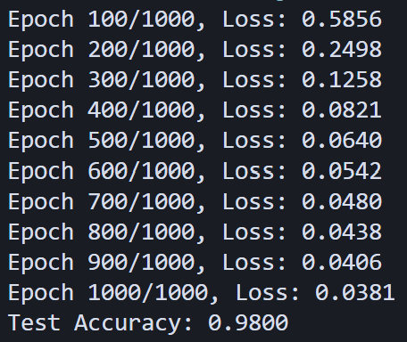
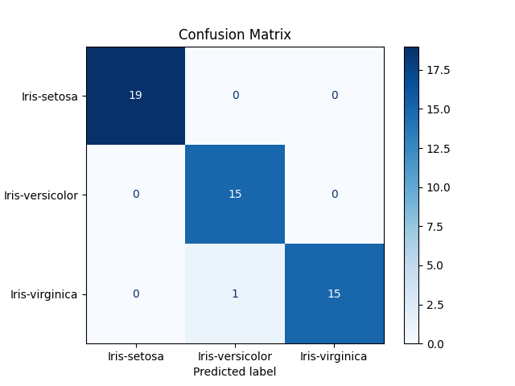
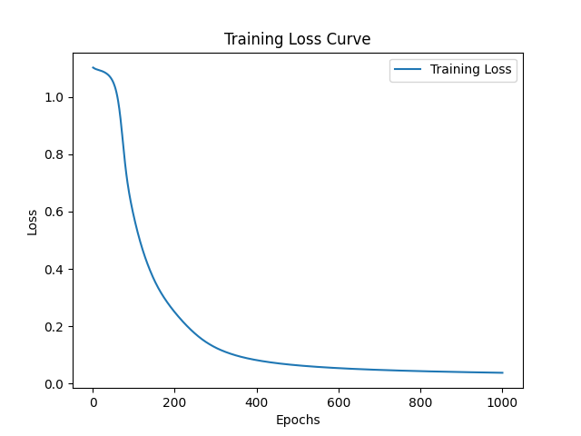

# Artificial Neural Network (ANN) from Scratch
This project implements a basic Artificial Neural Network (ANN) from scratch to classify the Iris dataset. The network consists of 3 layers: an input layer, two hidden layers, and an output layer, with ReLU activations for the hidden layers and softmax activation for the output layer. The model is trained using gradient descent and backpropagation, with cross-entropy loss for classification.

## Table of Contents
- [Project Overview](#project-overview)
- [Installation](#installation)
- [Dataset](#dataset)
- [Model Architecture](#model-architecture)
- [Training the Model](#training-the-model)
- [Evaluation](#evaluation)
- [Results](#results)
- [Contributions](#contributions)
- [License](#license)

## Project Overview
This project demonstrates the implementation of an ANN model from scratch to solve a classification problem using the Iris dataset. The objective of the project is to provide a simple, understandable example of a neural network built without the use of high-level libraries such as TensorFlow or PyTorch.

## Installation

### Prerequisites
To run this project, you need to have Python 3.7 or later installed along with the following libraries:
- `numpy`
- `pandas`
- `matplotlib`
- `scikit-learn`

You can install the required libraries using `pip`:
```bash
pip install numpy pandas matplotlib scikit-learn
```

### Clone the Repository
```bash
git clone https://github.com/yourusername/ann-from-scratch.git
cd ann-from-scratch
```

## Dataset
The Iris dataset contains 150 samples of iris flowers, divided into three species (setosa, versicolor, virginica). Each sample has four features: sepal length, sepal width, petal length, and petal width. This dataset is commonly used for classification tasks.

You can download the dataset [here](https://archive.ics.uci.edu/ml/datasets/iris).

### Dataset Structure
The dataset is in CSV format with the following columns:

- `sepal_length`: Sepal length in cm
- `sepal_width`: Sepal width in cm
- `petal_length`: Petal length in cm
- `petal_width`: Petal width in cm
- `species`: Iris flower species (Setosa, Versicolor, or Virginica)

## Model Architecture

The model consists of three layers:
1. **Input Layer**: Takes in four features (sepal length, sepal width, petal length, petal width).
2. **Hidden Layer 1**: Contains 10 neurons, uses ReLU activation.
3. **Hidden Layer 2**: Contains 8 neurons, uses ReLU activation.
4. **Output Layer**: Contains 3 neurons corresponding to the three classes, uses softmax activation.

## Training the Model

### Training Process
1. **Data Preprocessing**: The Iris dataset is loaded, and the categorical target variable (`species`) is encoded into numeric labels.
2. **Forward Pass**: The model computes the activations for each layer using the current weights.
3. **Loss Calculation**: The cross-entropy loss is computed.
4. **Backward Pass (Backpropagation)**: Gradients are computed, and the weights are updated using gradient descent.
5. **Epochs**: The model is trained for 1000 epochs with a learning rate of 0.01 and batch size equal to the training data size.

### Training Code
The training code is available in the `train.py` file. You can modify the number of epochs, learning rate, or batch size based on your preference.

## Evaluation

After training, the model is evaluated on the test set using the following metrics:
- **Accuracy**: Percentage of correctly predicted samples in the test set.
- **Confusion Matrix**: Visual representation of how the model performs for each class.

The results are shown using a confusion matrix and accuracy score.

## Results

After 1000 epochs of training, the model achieved a test accuracy of **98%** on the Iris dataset. The confusion matrix and the loss curve are also visualized.

### Output




### Confusion Matrix & Loss Curve

The confusion matrix visualization displays the model’s performance across all three classes.



## Contributions

If you'd like to contribute to this project, feel free to fork the repository, make changes, and submit a pull request. Contributions to improving the model, optimizing the code, or adding new features are highly appreciated.

## License

This project is licensed under the MIT License - see the [LICENSE](LICENSE) file for details.
